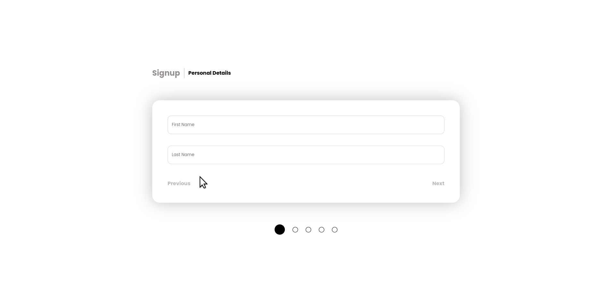

# Angular | Create A Multi-step Form Using An Angular Service And Dynamic Components

In this class, you will learn how to implement something you may already be familiar with,
multi-step forms:

<ol>
<li>Angular Service</li>
<li>Angular Dynamic Components</li>
<li>Component Interaction Using A Service</li>
</ol>

<h3>Remember, you stop growing the moment you stop learning, and what you learn go forth and teach someone</h3>

<h3>Demo</h3>

